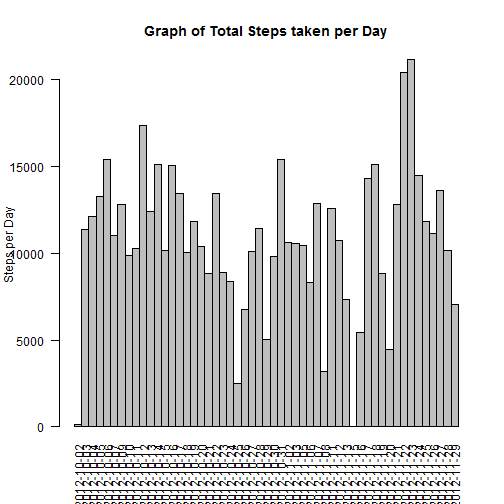
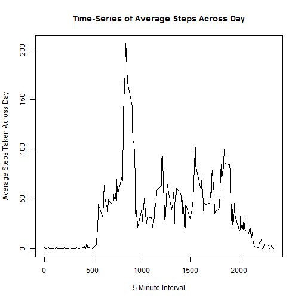
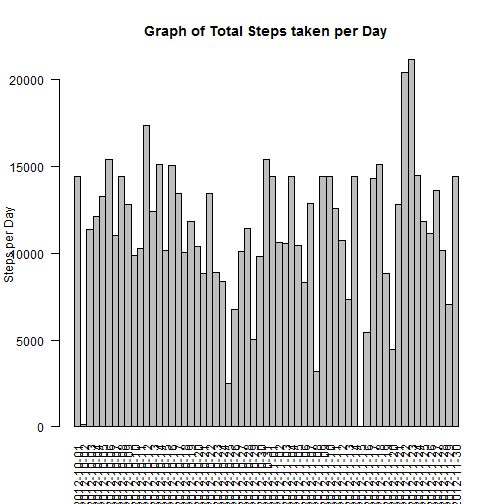
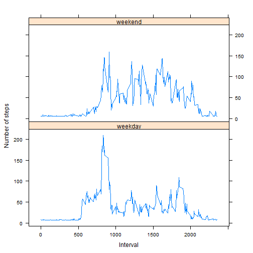

**Load the data and process the data if necessary**

```r
data <- read.csv("activity.csv",sep=",",header=T)
```

**Histogram**

```r
library(ggplot2)
data_na <- na.omit(data)
data_na$date <- as.Date(as.character(data_na$date),format="%Y-%m-%d")
step_per <- aggregate(data_na$steps,list(data_na$date),FUN=sum)
#Change the colnames
colnames(step_per) <- c("Date","steps")

#Create the Histogram
with(step_per, {
    par(las=2,xaxs="r")
    barplot(
        height=steps,
        main="Graph of Total Steps taken per Day",
        ylab="Steps per Day",
        names.arg=Date,
        space=c(0)
    )
})
```

 

**Median and Mean**


```r
mean(step_per$steps)
```

```
## [1] 10766.19
```

```r
median(step_per$steps)
```

```
## [1] 10765
```

**Average Steps Taken Across Day**

It should also show the time-series plot.


```r
Average_Steps <- aggregate(data=data,steps~interval,FUN=mean,na.action=na.omit)

with(Average_Steps,
     plot(interval,steps,type="l",xlab="5 Minute Interval",ylab="Average Steps Taken Across Day",main="Time-Series of Average Steps Across Day"))
```

 

**The 5-min interval where maximum steps taken**


```r
Average_Steps[Average_Steps$steps==max(Average_Steps$steps),]
```

```
##     interval    steps
## 104      835 206.1698
```

**The total number of missing values**


```r
nrow(data[is.na(data$steps),])
```

```
## [1] 2304
```

**Replace NA values with number 50**

Also, show the top portion of the new dataset with all missing values filled in.


```r
data[is.na(data)] <- 50
head(data)
```

```
##   steps       date interval
## 1    50 2012-10-01        0
## 2    50 2012-10-01        5
## 3    50 2012-10-01       10
## 4    50 2012-10-01       15
## 5    50 2012-10-01       20
## 6    50 2012-10-01       25
```

**Create histogram with the new data**

```r
new_sum_step <-aggregate(data$steps,list(data$date),FUN=sum)
colnames(new_sum_step) <- c("date","steps")
#Create the Histogram
with(new_sum_step, {
    par(las=2,xaxs="r")
    barplot(
        height=steps,
        main="Graph of Total Steps taken per Day",
        ylab="Steps per Day",
        names.arg=date,
        space=c(0)
    )
})
```

 


**New Median and Mean With NA Values Filled In**


```r
mean(new_sum_step$steps)
```

```
## [1] 11242.75
```

```r
median(new_sum_step$steps)
```

```
## [1] 11458
```

Both mean and median increase when NA values are filled in and added to the original data.

**Adding Weekday or Weekend**


```r
daytype <- data.frame(sapply(X = data$date, FUN = function(day) {
    if (weekdays(as.Date(day)) %in% c("Monday", "Tuesday", "Wednesday", "Thursday", 
        "Friday")) {
        day <- "weekday"
    } else {
        day <- "weekend"
    }
}))

newDataWithDayType <- cbind(data, daytype)

colnames(newDataWithDayType) <- c("Steps", "Date", "Interval", "DayType")
```

A few rows of the new data with day type added.


```r
head(newDataWithDayType)
```

```
##   Steps       Date Interval DayType
## 1    50 2012-10-01        0 weekday
## 2    50 2012-10-01        5 weekday
## 3    50 2012-10-01       10 weekday
## 4    50 2012-10-01       15 weekday
## 5    50 2012-10-01       20 weekday
## 6    50 2012-10-01       25 weekday
```

**Separate the data into weekday or weekend and calculate the average number of steps taken for each interval**

Show a few rows of the new data as well.


```r
daytypestep <- aggregate(
    data=newDataWithDayType,
    Steps ~ DayType + Interval,
    FUN=mean
)

head(daytypestep)
```

```
##   DayType Interval    Steps
## 1 weekday        0 8.688889
## 2 weekend        0 6.250000
## 3 weekday        5 7.066667
## 4 weekend        5 6.250000
## 5 weekday       10 6.822222
## 6 weekend       10 6.250000
```

**Finally, show the plot**


```r
library("lattice")

xyplot(
    type="l",
    data=daytypestep,
    Steps ~ Interval | DayType,
    xlab="Interval",
    ylab="Number of steps",
    layout=c(1,2)
)
```

 

